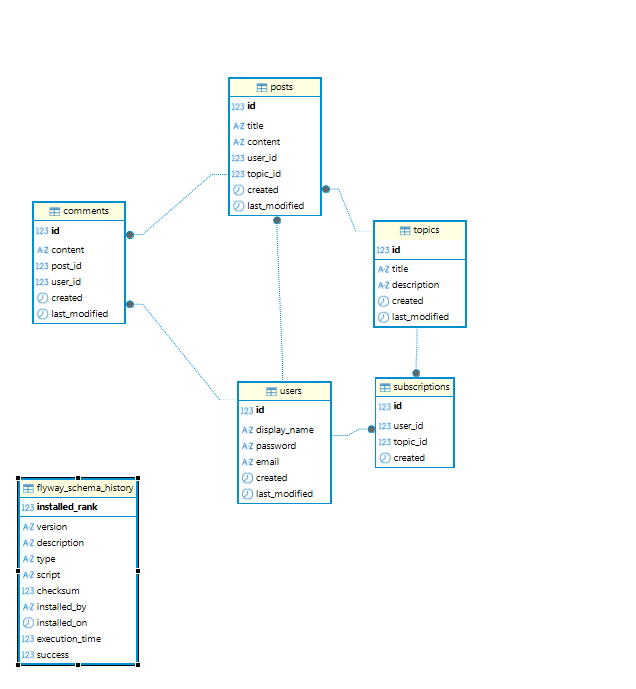
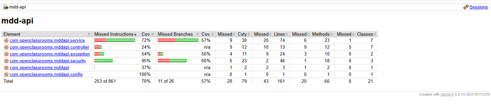

# MDD — Monde de Dév

> Réseau social dédié aux développeurs : articles, commentaires, abonnements à des thèmes.  

---

## Table des matières

1. [Présentation](#présentation)
2. [Architecture](#architecture)
3. [Schéma de base de données](#schéma-de-base-de-données)
4. [Backend (Spring Boot)](#backend-spring-boot)
   - [Prérequis](#prérequis)
   - [Dépendances clés](#dépendances-clés)
   - [Installation](#installation)
   - [Configuration](#configuration)
   - [Lancer en développement](#lancer-en-développement)
   - [Swagger / API Docs](#swagger--api-docs)
5. [Frontend (Angular)](#frontend-angular)
6. [Tests](#tests)
   - [Rapport de couverture](#rapport-de-couverture)
7. [Axes d'amélioration](#axes-damélioration)
8. [FAQ](#faq)
9. [IA & outils](#ia--outils)

---

## Présentation

MDD (Monde de Dév) est une application de réseau social orientée développeurs.  
Les utilisateurs peuvent s'inscrire, s'abonner à des thèmes techniques, publier des articles et commenter ceux des autres.

**MVP — fonctionnalités implémentées :**
- Inscription / connexion (email **ou** nom d'utilisateur + mot de passe)
- Consultation et modification de son profil
- Abonnement / désabonnement à des thèmes
- Fil d'actualité personnalisé (articles des thèmes suivis, tri chronologique)
- Création d'articles et de commentaires

---

## Architecture

```
root/
├── back/   → API REST Spring Boot 4
└── front/  → SPA Angular 14
```

Le backend expose une API REST sous le préfixe `/api`.  
L'authentification est stateless via **JWT** (Bearer token).

---

## Schéma de base de données



Les migrations sont gérées par **Flyway** (`src/main/resources/db/migration/`).  
Des données de développement sont disponibles dans `src/main/resources/db/data-dev.sql` (3 users, 5 topics, 5 posts, 5 comments, 6 subscriptions) — mots de passe : `Password1!`.

---

## Backend (Spring Boot)

### Prérequis

| Outil       | Version minimale |
|-------------|-----------------|
| Java        | 21+             |
| Maven       | 3.9+ (ou `./mvnw`) |
| MySQL       | 8.0+            |

> Les tests utilisent **H2 en mémoire** — aucune base de données nécessaire pour `./mvnw test`.

### Dépendances clés

| Librairie         | Rôle                                |
|-------------------|-------------------------------------|
| Spring Boot       | Framework principal                 |
| Spring Security   | Authentification / autorisation     |
| Spring Data JPA   | Persistance ORM                     |
| Flyway            | Migrations de schéma                |
| JJWT              | Génération et validation des JWT    |
| MapStruct         | Mapping Entity ↔ DTO                |
| springdoc-openapi | Swagger UI (profil `dev` seulement) |
| Lombok            | Réduction du boilerplate            |
| H2                | Base en mémoire pour les tests      |
| JaCoCo            | Rapport de couverture de tests      |

### Installation

```bash
# Cloner le dépôt
git clone <url-du-repo>
cd project_5/back

# Créer la base de données MySQL
mysql -u root -p -e "CREATE DATABASE mddapi_db CHARACTER SET utf8mb4 COLLATE utf8mb4_unicode_ci;"

# Compiler et lancer les tests
./mvnw verify
```

### Configuration

Le backend utilise des profils Spring. Le fichier `application-dev.properties` est **ignoré par git** — il doit être créé localement.

Variables minimales à définir dans `src/main/resources/application-dev.properties` :

```properties
# Datasource
spring.datasource.url=jdbc:mysql://localhost:3306/<votre_db>
spring.datasource.username=<user>
spring.datasource.password=<password>

# JWT
app.jwt.secret=<base64_secret>
app.jwt.expiration=86400000

# CORS
app.cors.allowed-origins=http://localhost:4200

# Swagger (dev uniquement)
springdoc.api-docs.enabled=true
springdoc.swagger-ui.enabled=true
```

> Pour générer un secret JWT valide : `openssl rand -base64 32`

### Lancer en développement

```bash
# Avec le profil dev
./mvnw spring-boot:run -Dspring-boot.run.profiles=dev

# Ou via variable d'environnement
SPRING_PROFILES_ACTIVE=dev ./mvnw spring-boot:run
```

L'API est accessible sur `http://localhost:8080/api`.

### Swagger / API Docs

Disponible **uniquement en profil `dev`** :

```
http://localhost:8080/api/swagger-ui.html
```

Pour authentifier les requêtes dans Swagger : cliquer sur **Authorize** et saisir `Bearer <votre_token>`.

---

## Frontend (Angular)

### Prérequis

| Outil       | Version minimale |
|-------------|-----------------|
| Node        | 16+             |
| npm         | 8+              |
| Angular CLI | 14+             |

### Installation et démarrage

```bash
cd project_5/front
npm install
ng serve
```

L'application est accessible sur `http://localhost:4200`.

---

## Tests

### Backend

#### Tests unitaires (Mockito)

| Classe                    | Tests | Ce qui est testé                              |
|---------------------------|-------|-----------------------------------------------|
| `AuthServiceTest`         | 6     | Login email/username, mauvais mdp, register, doublons email/username |
| `SubscriptionServiceTest` | 6     | Déjà abonné, topic inconnu, subscribe, sub introuvable, non propriétaire, unsubscribe |
| `PostServiceTest`         | 4     | findById trouvé/non trouvé, create topic inconnu, create succès |

#### Tests d'intégration (H2 in-memory)

| Classe                           | Tests | Ce qui est testé                          |
|----------------------------------|-------|-------------------------------------------|
| `MddApiApplicationTests`         | 1     | Démarrage du contexte Spring              |
| `AuthControllerIntegrationTest`  | 6     | Register, login (email/username), mauvais mdp, token invalide, profil me |
| `FeedControllerIntegrationTest`  | 2     | Feed sans auth (401), feed authentifié (200) |

> Les tests d'intégration utilisent **H2 en mode MySQL** avec `create-drop` — aucune configuration externe requise.  
> Flyway est désactivé en profil `test` (SQL MySQL-specific incompatible avec H2).

#### Rapport de couverture

Générer le rapport :
```bash
./mvnw test
# Rapport disponible dans : target/site/jacoco/index.html
```

Résultats (mappers, DTOs et entités exclus — code généré / sans logique métier) :



> **25 tests — 0 échec.**

### Frontend

Le frontend utilise **Karma + Jasmine**. Aucun test spécifique n'est défini pour le MVP.

---

## Axes d'amélioration

### Fonctionnels (post-MVP)

- **Rôles et back-office** : rôle `ADMIN` avec interface d'administration (gestion des utilisateurs, thèmes, modération des articles/commentaires)
- **Photo de profil** : upload d'avatar utilisateur (stockage S3 ou système de fichiers)
- **Notifications** : alertes lors d'un nouveau commentaire sur un article suivi
- **Réactions** : likes/upvotes sur les articles
- **Recherche** : recherche full-text sur les articles et les thèmes
- **Pagination côté client** : curseur plutôt qu'offset pour de meilleures performances sur de grands volumes

### Techniques

- **Testcontainers** : remplacer H2 par une vraie base MySQL en tests d'intégration (actuellement bloqué par une incompatibilité docker-java / Docker 29.x — [issue connue](https://github.com/testcontainers/testcontainers-java/issues))
- **CVE et dépendances** : audit régulier avec `./mvnw dependency-check:check` (OWASP) ou Dependabot
- **Refresh token** : implémenter la rotation des JWT (access token court + refresh token longue durée)
- **Rate limiting** : protéger les endpoints `/auth/**` contre le brute force
- **Cache** : mise en cache des listes de thèmes (Caffeine ou Redis) — données rarement modifiées
- **Observabilité** : Spring Boot Actuator + Micrometer + Prometheus/Grafana pour le monitoring
- **CI/CD** : pipeline GitHub Actions (build, tests, rapport de couverture, scan sécurité)

---

## FAQ

**Q : Pourquoi JWT sans refresh token ?**  
R : Le MVP exige que la session persiste — le token a une durée de 24h. Le refresh token est prévu comme amélioration post-MVP.

**Q : Pourquoi `getUsername()` retourne l'email dans `User` ?**  
R : Spring Security utilise `getUsername()` comme identifiant unique. L'email est l'identifiant canonique ; la connexion par `displayName` est gérée dans le `UserDetailsService` qui résout les deux.

**Q : Pourquoi H2 pour les tests et pas MySQL ?**  
R : Testcontainers (MySQL réel) est incompatible avec Docker 29.x dans l'environnement de développement actuel (`docker-java` hardcode l'API version 1.32, Docker 29.x nécessite 1.40 minimum). H2 en `MODE=MySQL` est un substitut fonctionnel pour le MVP.

**Q : Comment générer un JWT secret valide ?**  
```bash
openssl rand -base64 32
```
Le résultat doit être renseigné dans la variable d'environnement `JWT_SECRET`.

**Q : Le Swagger est accessible en prod ?**  
R : Non. `springdoc.swagger-ui.enabled=false` est défini dans `application.properties` (défaut) et `application-prod.properties`. Il n'est activé que via `application-dev.properties`.

---

## IA & outils

Ce projet a utilisé l'IA pour les tâches suivantes :

- **Documentation** : génération des commentaires Javadoc, annotations Swagger (`@Operation`, `@Tag`), et ce README
- **Boilerplate** : squelettes de classes (mappers MapStruct, DTOs, configuration Spring Security)
- **Tests unitaires** : génération des cas de test Mockito (`AuthServiceTest`, `SubscriptionServiceTest`, `PostServiceTest`) et des tests d'intégration MockMvc
- **Débogage** : diagnostic des incompatibilités Spring Boot 4 (`@AutoConfigureMockMvc` supprimé, `TestRestTemplate` supprimé) et de la migration Testcontainers → H2

> Tout le code généré a été relu, adapté et validé manuellement.

